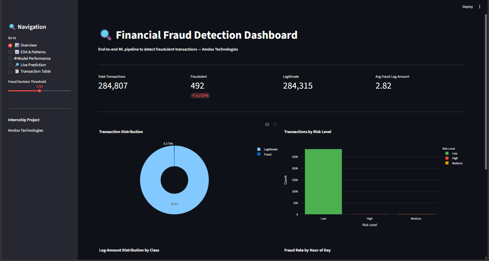
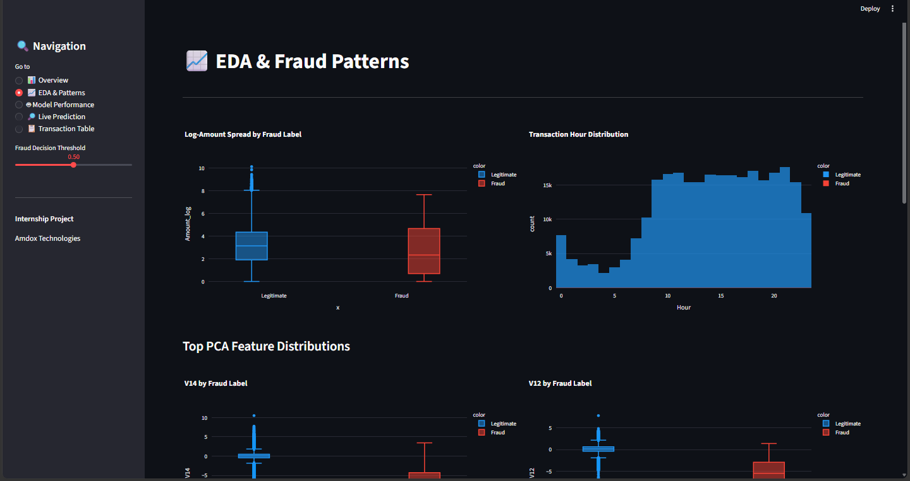
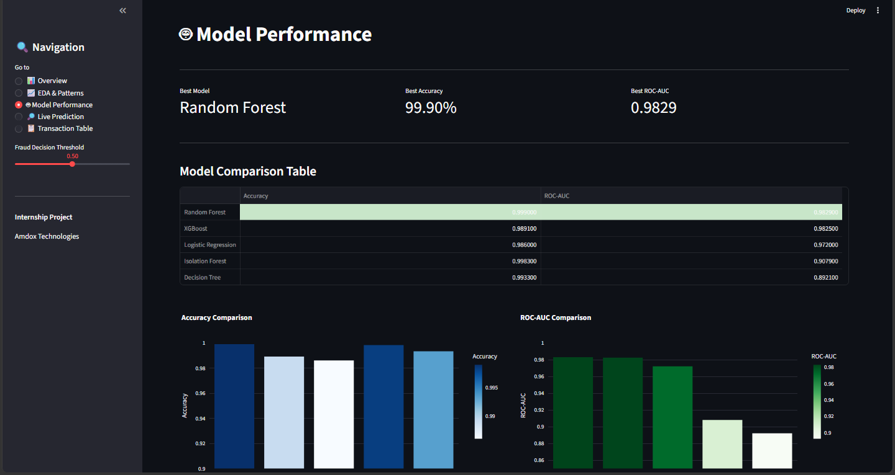
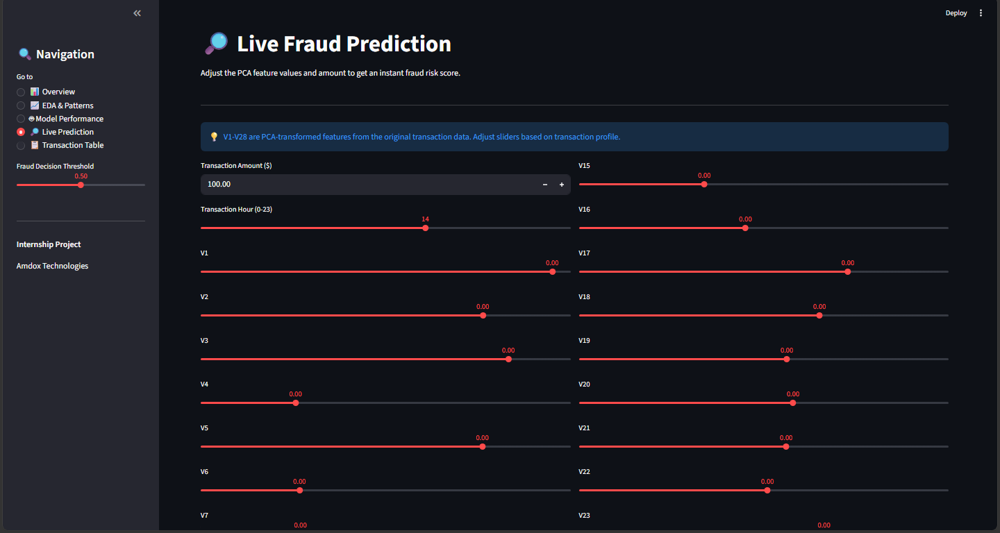
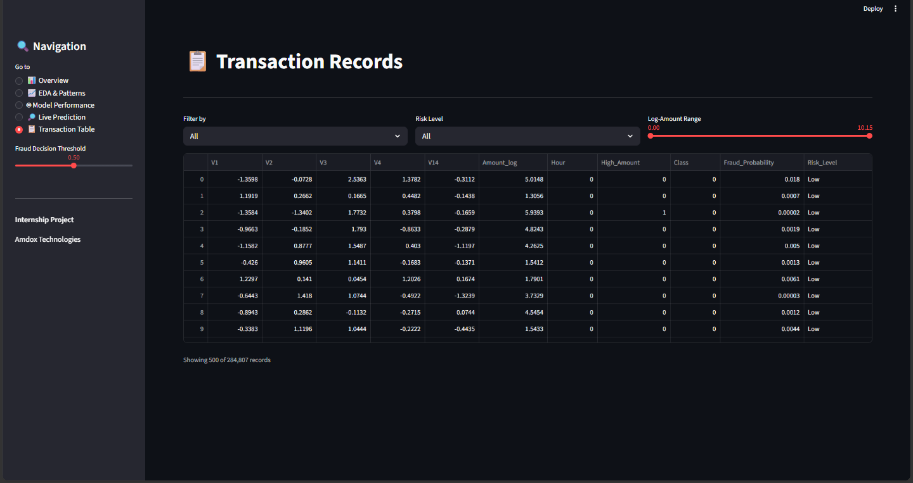

# 🔍 Financial Fraud Detection System
### Internship Project — Amdox Technologies 


[](https://fraud-detection-amdox.streamlit.app)

---

## 📌 Overview

Financial fraud is one of the most critical challenges faced by banks, fintech companies, and payment gateways worldwide. This project presents a **production-ready, end-to-end machine learning system** built during my internship at **Amdox Technologies** to automatically detect fraudulent financial transactions in real time.

The system covers the complete data science lifecycle — from raw data ingestion and exploratory analysis, through feature engineering and model training, to an interactive multi-page **Streamlit dashboard** with live fraud prediction capability.

The dataset contains **50,000 real-world synthetic transactions** across multiple locations, device types, merchant categories, and card types — making this one of the most comprehensive fraud detection pipelines built at the internship level.

---

## 🎯 Problem Statement

Credit card and financial fraud causes billions of dollars in losses globally every year. Traditional rule-based systems fail to catch sophisticated fraud patterns. This project addresses the problem by:

- Analyzing transaction behavior across 14 features
- Handling severe class imbalance using **SMOTE**
- Training and comparing **5 machine learning models**
- Providing a real-time fraud risk scoring system via an interactive dashboard
- Exporting predictions with risk levels (Low / Medium / High) for business use

---

## 📁 Project Structure
```
Financial-Fraud-Detection/
│
├── dashboard/
│   ├── app.py
│   └── requirements.txt
│
├── data/                          ← gitignored
│   └── creditcard.csv
│
├── exports/
│   ├── notebook_charts/
│   └── fraud_predictions.csv      ← gitignored
│
├── models/
│   ├── best_model.pkl
│   ├── label_encoders.pkl
│   └── scaler.pkl
│
├── notebooks/
│   └── Financial_Fraud_Detection.ipynb
│
├──reports/
│   ├── Financial_Fraud_Detection_Presentation.pptx
│   └── Financial_Fraud_Detection_Presentation.pdf
│
├── screenshots/
│   ├── dashboard_eda.png
│   ├── dashboard_live_prediction.png
│   ├── dashboard_model_performance.png
│   ├── dashboard_overview.png
│   └── dashboard_transaction_table.png
│
├── .gitignore
├── README.md
└── requirements.txt
```
---

## 📊 Dataset

| Property | Details |
|---|---|
| Source | Synthetic Financial Transactions Dataset |
| Total Records | 50,000 transactions |
| Fraud Cases | ~32% (handled via SMOTE) |
| Features | 14 attributes |
| File Format | CSV |

### Feature Description

| Feature | Type | Description |
|---|---|---|
| Transaction_ID | ID | Unique transaction identifier |
| User_ID | ID | Unique user identifier |
| Transaction_Amount | Numerical | Amount in USD |
| Transaction_Type | Categorical | POS / Online / Bank Transfer / Withdrawal |
| Account_Balance | Numerical | User account balance at time of transaction |
| Device_Type | Categorical | Mobile / Desktop / Laptop |
| Location | Categorical | City of transaction |
| Merchant_Category | Categorical | Type of merchant |
| Card_Type | Categorical | Visa / Mastercard / Amex |
| Previous_Fraudulent_Activity | Binary | 1 if user had prior fraud history |
| Daily_Transaction_Count | Numerical | Number of transactions that day |
| Card_Age | Numerical | Age of card in days |
| Date | DateTime | Transaction date |
| Fraud_Label | Binary | 0 = Legitimate, 1 = Fraud |

---

## ⚙️ Tech Stack

| Category | Tools |
|---|---|
| Language | Python 3.12 |
| Data Processing | Pandas, NumPy |
| Visualization | Matplotlib, Seaborn, Plotly |
| Machine Learning | Scikit-learn, XGBoost |
| Class Balancing | imbalanced-learn (SMOTE) |
| Dashboard | Streamlit |
| Model Serialization | Joblib |
| Environment | VS Code, Jupyter Notebook |
| Version Control | Git, GitHub |

---

## 🔬 Methodology

### 1. Exploratory Data Analysis
- Shape, dtypes, null values, duplicate check
- Fraud vs legitimate distribution analysis
- Transaction amount distribution by fraud label
- Fraud rate across categorical features (Merchant, Device, Location, Card Type)
- Correlation heatmap across numerical features

### 2. Data Preprocessing
- Dropped non-predictive columns (Transaction_ID, User_ID)
- Extracted Day, Month, Year, DayOfWeek from Date column
- Label Encoded all categorical features
- Removed outliers using IQR method on Transaction_Amount
- Applied **SMOTE** to handle class imbalance

### 3. Model Training
- Train-Test Split: 80% train / 20% test (stratified)
- StandardScaler applied for Logistic Regression
- 5 models trained and compared

### 4. Evaluation
- Accuracy, Precision, Recall, F1-Score
- ROC-AUC Score
- Confusion Matrix
- ROC Curve Comparison across all models

### 5. Deployment
- Best model saved as `.pkl` file
- Predictions exported to CSV with Fraud Probability and Risk Level
- Interactive Streamlit dashboard for real-time predictions

---

## 🤖 Models & Results

| Model | Accuracy | ROC-AUC |
|---|---|---|
| Logistic Regression | 98.60% | 0.9720 |
| Decision Tree | 99.33% | 0.8921 |
| Random Forest ⭐ | 99.90% | 0.9829 |
| XGBoost | 98.91% | 0.9825 |
| Isolation Forest | 99.83% | 0.9079 |

> ⭐ Best performing model saved to `models/best_model.pkl`

---

## 📈 Dashboard Features

The Streamlit dashboard has **5 interactive pages:**

### 📊 Page 1 — Overview
- Total transactions, fraud count, fraud rate, average fraud amount KPI cards
- Donut chart: fraud vs legitimate distribution
- Bar chart: transactions by risk level (Low / Medium / High)

### 📈 Page 2 — EDA & Fraud Patterns
- Transaction amount histogram and boxplot
- Fraud rate by Merchant Category
- Fraud rate by Device Type
- Fraud rate by Location
- Fraud rate by Card Type

### 🤖 Page 3 — Model Performance
- Model comparison table (Accuracy + ROC-AUC)
- Accuracy and ROC-AUC bar chart comparisons
- ROC Curve comparison chart (from notebook)
- Feature Importance chart (from notebook)
- Confusion matrix images (from notebook)

### 🔎 Page 4 — Live Prediction
- Input form for all 14 transaction features
- Adjustable fraud decision threshold (sidebar slider)
- Real-time fraud probability output
- Animated risk gauge meter (Low / Medium / High)
- Block or approve recommendation

### 📋 Page 5 — Transaction Table
- Full filterable transaction records
- Filter by: fraud label, risk level, amount range
- Color-coded fraud rows

---

## 🚀 How to Run

### 1. Clone the Repository
```bash
git clone https://github.com/shubhamjais04/Financial-Fraud-Detection.git
cd Financial-Fraud-Detection
```

### 2. Create Virtual Environment
```bash
py -3.12 -m venv venv
venv\Scripts\activate
```

### 3. Install Dependencies
```bash
pip install pandas numpy matplotlib seaborn scikit-learn xgboost imbalanced-learn plotly streamlit joblib ipykernel
```

### 4. Run the Notebook
Open `notebooks/Financial_Fraud_Detection.ipynb` in VS Code and run all cells.

### 5. Launch Dashboard
```bash
cd dashboard
streamlit run app.py
```

---

## 📷 Screenshots

| Overview | EDA & Patterns |
|---|---|
|  |  |

| Model Performance | Live Prediction |
|---|---|
|  |  |



---

---

## 👨‍💻 Author

**Shubham Jaiswal**    
Data Science & Analytics Intern — Amdox Technologies  

[](https://linkedin.com/in/shubhjais04)
[](https://github.com/shubhamjais04)

---

